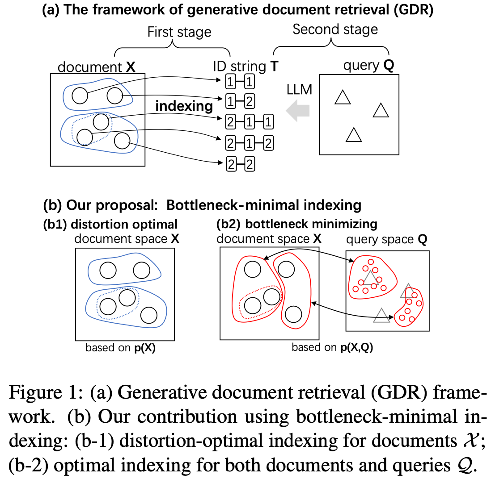
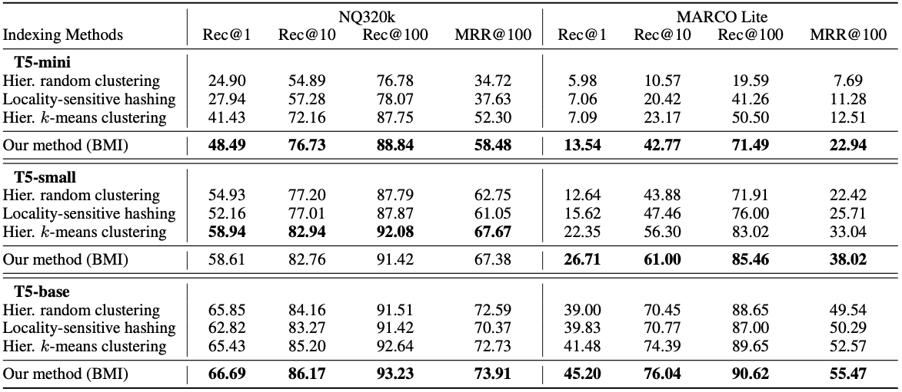

# [ICML 2024] Bottleneck Minimal Indexing for Generative Document Retrieval
Code for the following paper:
- Xin Du, Lixin Xiu, and Kumiko Tanaka-Ishii. *Bottleneck Minimal Indexing for Generative Document Retrieval*. In ICML 2024.

If you find the work useful, please cite the following paper:
```bibtex
@inproceedings{
    du2024bottleneckminimal,
    title={Bottleneck-Minimal Indexing for Generative Document Retrieval},
    author={Du, Xin and Xiu, Lixin and Tanaka-Ishii, Kumiko},
    booktitle={Forty-first International Conference on Machine Learning},
    year={2024},
    url={https://openreview.net/forum?id=MFPYCvWsNR}
}
```

## Bottleneck-Minimal Indexing

<center>

</center>

We reconsider the document retrieval process as a data transmission problem from
a query to a document, where the index for the document forms a "information
bottleneck." Previous works including DSI [1] and NCI [2] for generative
document retrieval (GDR) proposed to index every document with a unique number
string, such as "1-29-3-6". The indexing was produced through a hierarchical
k-means clustering of document embeddings. However, this optimality of k-means
clustering was not theoretically explored.

In this work, we formulate this indexing problem by using the *information
bottleneck theory* of Tishby et al. [3], and showed that the indexing must be
produced by considering queries distributions, in addition to document
distributions, to realize information-theoretical optimality. We propose a new
indexing method called the *bottleneck-minimal indexing* (BMI), which is a
simple adaptation of the original indexing method in DSI & NCI: to apply the
hierarchical k-means algorithm to the query embeddings, rather than the document
embeddings. This simple change leads to a significant improvement in the
retrieval performance on NQ320K and Marco datasets, especially for smaller
models, as shown in the following Table.




References:
- Tay, Y., Tran, V., Dehghani, M., Ni, J., Bahri, D., Mehta, H., ... & Metzler, D. (2022). Transformer memory as a differentiable search index. Advances in Neural Information Processing Systems, 35, 21831-21843.
- Wang, Y., Hou, Y., Wang, H., Miao, Z., Wu, S., Chen, Q., ... & Yang, M. (2022). A neural corpus indexer for document retrieval. Advances in Neural Information Processing Systems, 35, 25600-25614.
- Tishby, N., Pereira, F. C., & Bialek, W. (2000). The information bottleneck method. arXiv preprint physics/0004057.

## About the code

We provide the code to reproduce the results on the NQ320K dataset.

### 1. Environment preparation

```bash
(Optionally, create a new environment with CUDA 12 support)

$ pip install -r requirements.txt
```

### 2. Data preparation
Please follow the instructions in `scripts/NQ320K/preprocess_NQ320K.ipynb` to
prepare the data and indexings for the original method (HKmI, Hierarchical
K-means Indexing) and our method (BMI).

### 3. Training
To train a retrieval model based on the indexing produced by our method (BMI),
run the script in `scripts/NQ320K/train_BMI.sh`. Optionally, run
`scripts/NQ320K/train_HKmI.sh` to train a retrieval model based on the indexing
produced by the original method (HKmI).

It is recommended to use WanDB for tracking the training process.
To do that, get your API key from https://wandb.ai/ and insert the key
into WANDB_API_KEY in the training scripts.

### 4. Evaluation
Run the script in `scripts/NQ320K/infer.sh`. You must specify the path to the
trained model (**.ckpt) and the data in the script.

## Acknowledgments
A large part of the code is based on the implementation of
[NCI](https://github.com/solidsea98/Neural-Corpus-Indexer-NCI?tab=readme-ov-file).
We thank the authors for their great work.
